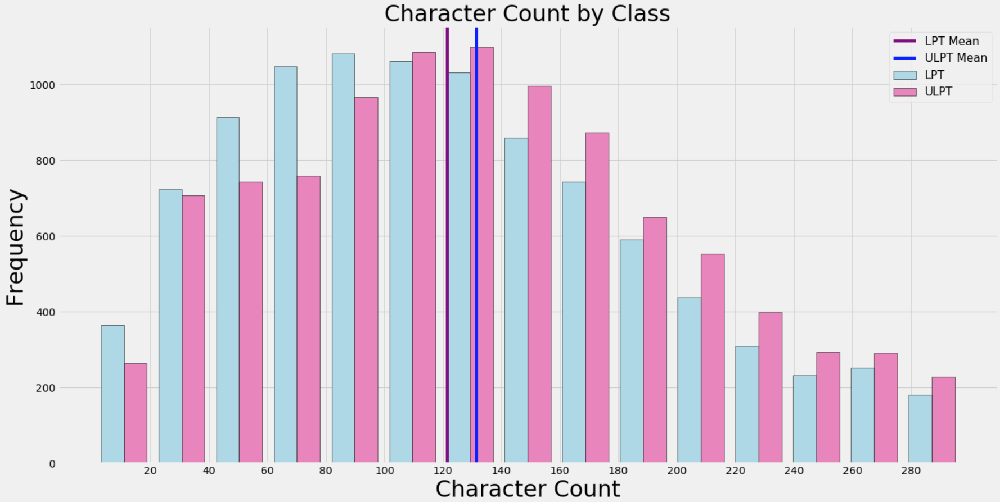
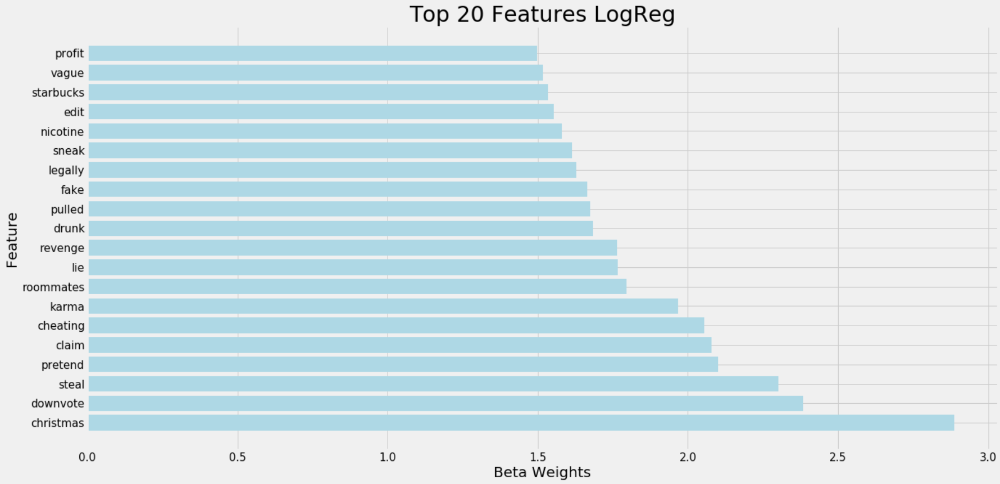
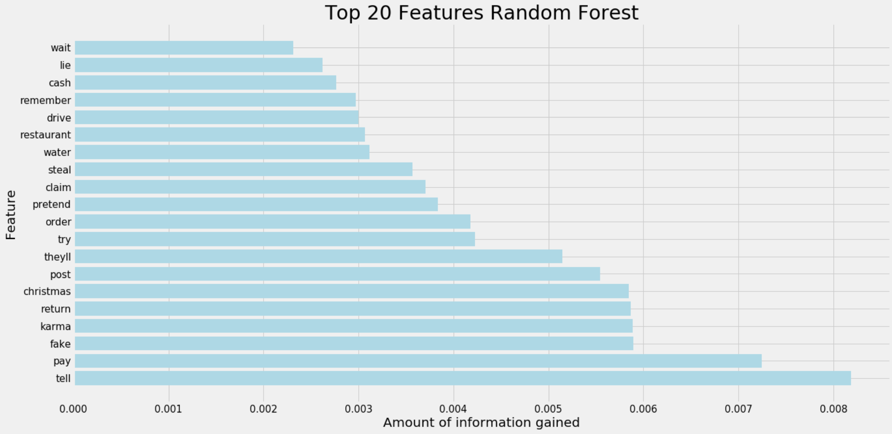

# Web APIs & Classification: A look into how to remove toxic and insincere content from the world wide web

# Executive Summary

### 1. Problem Statement 

The Internet is full of toxic posts and comments ad nauseum. As a member of the coalition to minimize and locate internet toxicity, I am proposing that in the near future we should replace human moderators with bots on sites where it is plausible based on the community. I have created models to predict whether or not a given post is toxic or unethical, given the use of different words. I think the specific words people use on the internet can give insight into their general thoughts about humanity and life. I think we should encourage online forums, social media sites like facebook and twitter, and videostreaming sites like youtube to find when toxic things are posted, and to look further into those posts and the users' histories to assess whether or not they will continue to push the ideas presented in what they said. I will use a Logistic Regression model, as it can be a good classification model, and I will also implement a random forest classifier that will create multiple decision trees and combine them to best predict whether or not something is from my target class (unethical).I will test the success of my models by comparing my training set to a test set, as well as bringing in an outside resource from the kaggle competition 'Quora Insincere Questions Classification'. My model will be graded on its accuracy predicting to the target class, Unethical (1). I will examine specific words that give my model information and I will examine the probabilities of each prediction, meaning that I will look at if a given post was 55% likely to be in the target class, or 45%, as these percentages are right around the middle and sometimes it can be difficult to distinguish posts that exist on the borderline. 

### 2. Data

In this project, I examined posts from reddit.com. I used the pushshift api to query 20,000 posts from two subreddits, LifeProTips and UnethicalLifeProTips, 10,000 titles from each. After cleaning the data, my distribution of classes was 50.2% to 49.8%, so my classes were still very much even. The titles in LPT have mean word counts of 23 words, while the titles in ULPT have mean word counts of 25 words. As expected, they do have some overlap in the words used, so I will be adding these words to a 'stoplist' so that they are not considered in my modeling. Below is a histogram displaying the distribution of character counts in each class.

In addition, I pulled data from [Kaggle's Quora Insincere Competition](https://www.kaggle.com/c/quora-insincere-questions-classification/data) to test my models against unseen data. The kaggle data contains over a million entries, with a significantly unbalanced class distribution. The distribution of insincere posts was 6% to 94%, in favor of the 0 class, or legitimate posts. 

### 3. Modeling

The logistic Regression Classifier performed well on my reddit data, but not as well as the Random Forest Classifier. With a training accuracy of 94% and a testing accuracy of 78%, it was pretty overfit, but considering that we are dealing with classification, a 28% improvement from my baseline model is pretty substantial. Some of the keywords that gave the most information to my model are below in the graph. When I examined the middle 10% of predicted probabilities, I found that only 7% of my titles were between 45% and 55% probability of being in the target class. I think this is a pretty good indication that my model found some very polar examples of words that would be used in a toxic environment vs. a nontoxic environment. In my kaggle data, logistic regression had an accuracy score of 60%, which is pretty great for a real world example. 

I was expecting the Random Forest Classifier to blow the logreg classifier out of the water. The reality, though, is that it didn't. It was amazing on the training data, with an accuracy score of 99%, but on the testing data, it marginally edged out the logistic regression model, with an accuracy score of 79%. Random Forest is a quick and effective classifier, as it comes from the decision tree classifiers. It is different in that it picks from a random subset of features at each node before making the best split it can. I used 100 estimators, meaning there were 100 trees in the forest, and I used the default features, so there were about 126 features considered in my model. The top 20 features that gave the model 'the most information' were pretty similar to the top 20 features for logistic regression, with a few differences. The plot is below. I created a confusion matrix for my random forest model, and it showed that about 1/8 of all of the posts in the testing data were 'false negatives' which in this model is what I was trying to minimize. It is better for my model to flag regular posts as toxic than to let toxic posts slide through the cracks. 

### 4. Conclusion

In conclusion, I think that while technology, including my models, currently has difficulty reading sarcasm, it is pretty adempt at finding words that stick out from the normal, everyday words that most people use on a regular basis. If we can introduce a strong 'toxicity and insincerity' model to social media websites and other online forums, they will be able to implement these models to detect toxic behavior and toxic language, and perhaps they can pay closer attention to people who use language like this on regular basis. Instead of having moderators reading every post and relying on people to report toxic commentary, our model can do it for them and the moderators can spend their time on other things. 

'Revenge', 'Lie', 'Cocaine', 'abortion', 'cheat' are all words that have come up as being strong predictors of unethical posts. These seem obvious. Looking further, it is apparent that some words are reveal more while staying 'under the surface'. A few of these words include 'tell', 'theyll', 'claim', and 'christmas'. Looking into these more subtle words, we can read into deeper meanings than just the surface meaning. 'They' is talking about people not currently present, and is using a pronoun instead of saying who 'they' actually are. This could imply sneakiness or trying to get a leg up on 'them'. 'Claim' might imply that the 'claim' isn't true.  'Christmas' was an outlier in my mind. It seems that people use the holidays as a time to post easy workarounds to things that other people work hard for. 

While many of these posts are simply insincere, troll, or humor based posts, some of them are not, and if we can key into those that aren't humorous based on historical posts by the user(perhaps with another model), we can hopefully implement this model to report or remove posts that break the rules of the forum or website.  I believe the best model in my arsenal right now is the logistic regression model. While it wasn't as accurate as the random forest model, it was very close, within a percent on the testing data, scoring 78% to the random forest test score of 79%. A marginal difference at best. Even more, when I introduced kaggle's quora training data, which, in this case can represent 'real world' data, the logistic regression model had an accuracy of 60%, vs. the random forest's 55%. This may seem low, considering that the baseline is 50%, but it is a start to recognizing insincere online behavior! 

### 5. Next Steps

As mentioned above, perhaps another model that goes through historical posts of a user could be useful in detecting that user's specific tone. By far, most toxic posts on the internet are troll worthy posts that don't last 10 seconds in others' minds, but there are some posts that are indicative of real life behavior that can be harmful and toxic. If we can hone in on these posts, we can take next steps to preventing that type of behavior and removing or banning users who continue to break the rules of different forums. I would like to also look into different n_gram ranges to see how combinations of words can affect the model's recognition of toxicity.

# Notebooks:
1. [Pushshift API Querying](./adam_burpee_la7/code/01_pushshift_query.ipynb)
1. [Data Cleaning](./adam_burpee_la7/code/02_data_cleaning.ipynb)
1. [Logistic Regression Modeling](./adam_burpee_la7/code/03_modeling.ipynb)
1. [Random Forest Modeling](./adam_burpee_la7/code/03b_modeling_rf.ipynb)

